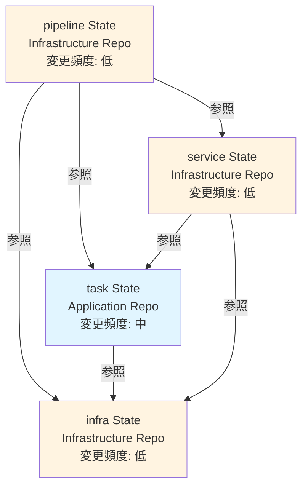
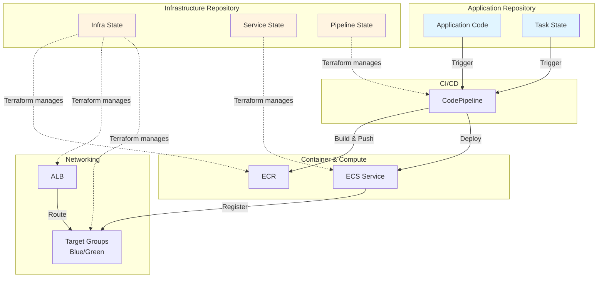
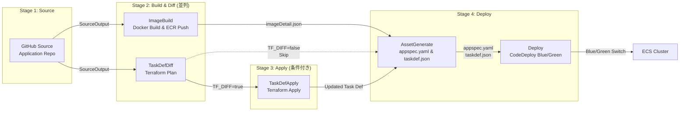
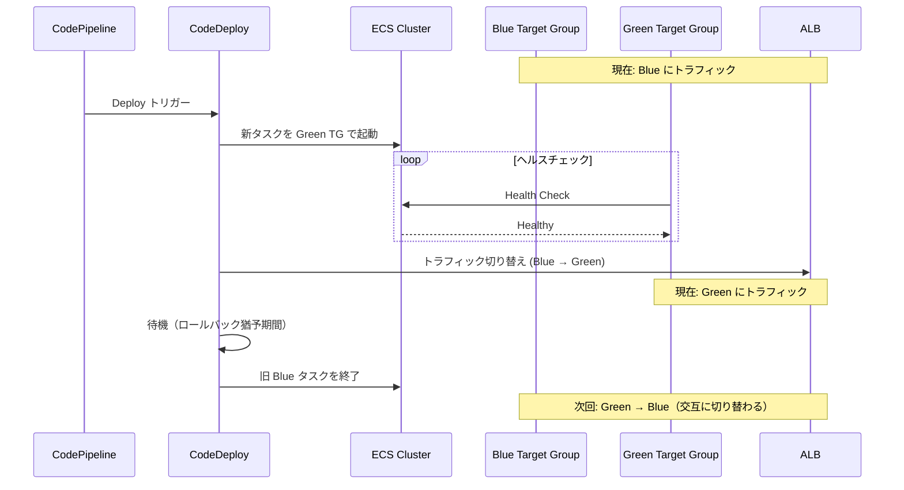
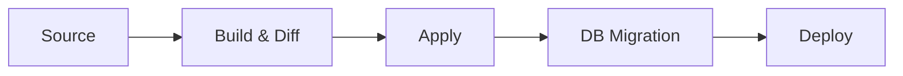
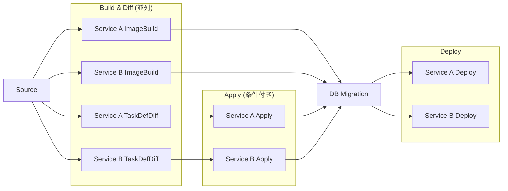

# ECS アプリケーション CI/CD アーキテクチャガイドライン

## 目次

1. [概要](#概要)
2. [この構成を選ぶべきケース](#この構成を選ぶべきケース)
3. [State 管理とリポジトリ](#state-管理とリポジトリ)
4. [デプロイフロー](#デプロイフロー)
5. [デプロイ戦略の選択](#デプロイ戦略の選択)
6. [パターンのバリエーション](#パターンのバリエーション)
7. [運用上の注意点](#運用上の注意点)
8. [実装リファレンス](#実装リファレンス)

---

## 概要

Terraform を使用して ECS アプリケーションをデプロイする際の State 分割と CodePipeline によるデプロイフローの推奨アーキテクチャ。

[CodePipeline 標準化の方針](codepipeline-standard-policy.md) における **型 B**（`Source → Build → … → Build`）に該当する。ビルド成果物（Docker イメージ）を後段で AWS に反映するパターン。

### 主要な原則

- **State 分離**: 変更頻度とオーナーシップの異なる関心事を分離し、独立したデプロイライフサイクルを実現
- **リポジトリ分離**: Infrastructure リポジトリと Application リポジトリに分離
- **Blue/Green デプロイ**: CodeDeploy を使用したゼロダウンタイムデプロイと自動ロールバック
- **条件付き適用**: Terraform diff で変更を検知し、必要な場合のみインフラ変更を適用

---

## この構成を選ぶべきケース

| 条件 | ECS (本ガイド) | Lambda ([別ガイド](app-lambda-cicd-guideline.md)) |
|---|---|---|
| 実行時間 | 長時間・常時稼働 | 短時間（最大 15 分） |
| トラフィックパターン | 安定的・予測可能 | スパイク・イベント駆動 |
| コンテナカスタマイズ | OS やランタイムを自由に選択したい | マネージドランタイムで十分 |
| コールドスタート | 許容できない | 許容できる |
| デプロイ戦略 | Blue/Green や Canary が必要 | シンプルな更新で十分 |
| コスト | 常時稼働コストを許容できる | 実行時間課金を活用したい |

---

## State 管理とリポジトリ

### なぜ 4 State に分割するのか

ECS アプリケーションのインフラを単一の State で管理すると、以下の問題が起きる：

- **アプリコード変更のたびにインフラ全体の plan が走る**（遅い）
- **タスク定義の変更にインフラチームの承認が必要**（ボトルネック）
- **パイプラインの設定変更が ECS サービスに影響するリスク**（爆発半径が大きい）

これを解決するため、**変更頻度** と **オーナーシップ** の 2 軸で分割する。

### 分割の考え方

```
          Freq: Low              Freq: High
        ┌──────────────────┐   ┌──────────────────┐
        │ infra State      │   │                  │
        │ (ALB, ECR, TG)   │   │                  │
Infra   │                  │   │                  │
Team    │ service State    │   │                  │
        │ (ECS Service)    │   │                  │
        │                  │   │                  │
        │ pipeline State   │   │                  │
        │ (CodePipeline)   │   │                  │
        └──────────────────┘   └──────────────────┘
        ┌──────────────────┐   ┌──────────────────┐
App     │                  │   │ task State        │
Team    │                  │   │ (Task Def, IAM)   │
        │                  │   │                  │
        │                  │   │ Application Code  │
        └──────────────────┘   └──────────────────┘
```

### State 依存関係



### ディレクトリ構成

```
# Infrastructure Repository
terraform/env/{env}/
├── {service}-infra/    → {service}-infra/terraform.tfstate
├── {service}-service/  → {service}-service/terraform.tfstate
└── {service}-pipeline/ → {service}-pipeline/terraform.tfstate

# Application Repository
terraform/env/{env}/
└── {service}-task/     → {service}-task/terraform.tfstate
```

### 各 State の責務

| State | 配置 | 主要リソース | 変更トリガー |
|---|---|---|---|
| **infra** | Infrastructure | ALB, Target Groups (Blue/Green), ECR | ALB 設定変更、新リポジトリ追加 |
| **task** | Application | Task Definition, Execution Role, Task Role | 環境変数追加、IAM 権限変更、リソース設定変更 |
| **service** | Infrastructure | ECS Service, Security Groups | スケーリング設定、デプロイ設定変更 |
| **pipeline** | Infrastructure | CodePipeline, CodeBuild, CodeDeploy | パイプライン構成変更 |

**task State を Application リポジトリに置く理由**: タスク定義はアプリケーションの環境変数・IAM 権限・リソース設定と密結合しており、アプリ開発者が自律的に変更できる必要がある。インフラリポジトリへの PR を必要としないことで、デプロイ速度を維持する。

---

## デプロイフロー

### 全体像



### CodePipeline ステージフロー



### ステージ詳細

#### Stage 1: Source

GitHub から Application リポジトリのソースを取得。特定ブランチ（`develop`, `main` 等）への Push でトリガー。

#### Stage 2: Build & Diff（並列実行）

2 つのジョブを `run_order = 1` で **並列実行** し、パイプライン全体の所要時間を短縮する。

| ジョブ | 入力 | 処理 | 出力 |
|---|---|---|---|
| **ImageBuild** | ソースコード | Docker ビルド → ECR Push | `imageDetail.json`（イメージタグ） |
| **TaskDefDiff** | ソースコード | `terraform plan` で Task State の差分検知 | `TF_DIFF` 環境変数 (`true`/`false`) |

#### Stage 3: Apply（条件付き実行）

**TaskDefDiff の結果に基づく分岐ロジック:**

| 変更パターン | `TF_DIFF` | Apply | 理由 |
|---|---|---|---|
| アプリコードのみ変更 | `false` | スキップ | タスク定義に変更なし。イメージタグだけ更新すればよい |
| タスク定義も変更 | `true` | 実行 | 環境変数追加・IAM 変更等を先に反映する必要がある |

**注意**: Apply ステージでは Terraform に記述された固定イメージタグでタスク定義が作成される。しかし、次の AssetGenerate ステージで最新イメージタグ（`IMAGE1_NAME`）を使った `taskdef.json` が再生成されるため、最終的なデプロイには正しいイメージが使われる。

#### Stage 4: Deploy（Blue/Green）

1. **AssetGenerate**: CodeDeploy 用の `appspec.yaml` と `taskdef.json` を生成
2. **Deploy**: CodeDeploy による Blue/Green デプロイを実行

### Blue/Green デプロイシーケンス



---

## デプロイ戦略の選択

本ガイドでは Blue/Green を推奨するが、要件によっては別の戦略が適切な場合もある。

| 戦略 | ダウンタイム | ロールバック | コスト | 適しているケース |
|---|---|---|---|---|
| **Blue/Green** | なし | 即座（トラフィック切り替え） | 一時的に 2 倍のタスク | 本番環境、ロールバック速度が重要 |
| **Rolling** | なし | 遅い（再デプロイ必要） | 追加コストなし | 開発環境、コスト重視 |
| **Canary** | なし | 即座 | 一部追加 | 段階的なリリース検証が必要 |

### Blue/Green を推奨する理由

1. **即座のロールバック**: トラフィック切り替えだけで戻せる（新タスクの再起動不要）
2. **デプロイ前の検証**: Green 環境でヘルスチェックが通ってからトラフィックを切り替える
3. **CodeDeploy との統合**: AWS 標準の仕組みで実現でき、Terraform との相性がよい

### Rolling が適切なケース

- 開発・ステージング環境でコストを抑えたい
- ロールバック速度が重視されない
- タスク数が多く Blue/Green だと一時的なリソースコストが大きい

---

## パターンのバリエーション

### DB マイグレーション付きデプロイ

データベーススキーマ変更を伴う場合、Deploy 前に Migration ステージを追加する。



**設計上の注意:**
- マイグレーションは **前方互換** で行う（旧コードでも動く状態にしてから新コードをデプロイ）
- ロールバック時にマイグレーションは巻き戻されない前提で設計する

### 複数サービスの統合デプロイ

同じ DB を参照する複数サービスを 1 つのパイプラインでデプロイし、DB マイグレーションの整合性を保証する。



**使い分けの判断基準:**
- DB スキーマを共有する → 統合パイプライン
- 独立した DB を持つ → 個別パイプライン

---

## 運用上の注意点

### パイプライン実行中のタスク定義変更

パイプライン実行中に手動で `terraform apply`（Task State）を行うと、AssetGenerate で生成する `taskdef.json` と実際のタスク定義にずれが生じる可能性がある。**パイプライン実行中は Task State への手動変更を避ける。**

### imageDetail.json の仕組み

CodeBuild の ImageBuild ステージが出力する `imageDetail.json` は、CodeDeploy が `<IMAGE1_NAME>` プレースホルダを置換する際に使用される。このファイルのフォーマットは以下の通り：

```json
{
  "ImageURI": "{account}.dkr.ecr.{region}.amazonaws.com/{repo}:{tag}"
}
```

### ロールバックの挙動

CodeDeploy による Blue/Green デプロイでは、以下のタイミングで自動ロールバックが発動する：

- Green タスクのヘルスチェックが失敗
- デプロイ待機中にアラームが発火（CloudWatch Alarm 連携時）
- 手動でロールバックを実行

ロールバック時は **トラフィックを旧 Blue に戻す** だけなので、数秒で完了する。

---

## 実装リファレンス

本ガイドラインのアーキテクチャは、リポジトリ内の既存モジュールと env 設定で実装済み。新規プロジェクトではこれらをコピー・カスタマイズして利用する。

### モジュール構成

| ガイドラインの概念 | モジュール / ディレクトリ | 説明 |
|---|---|---|
| Pipeline State 全体 | [`modules/codepipeline/pipeline-app-ecs/`](../../modules/codepipeline/pipeline-app-ecs/) | Build + Deploy 2 段パイプライン |
| コア (CodePipeline + CodeBuild) | [`modules/codepipeline/github-buildchain/`](../../modules/codepipeline/github-buildchain/) | `pipeline-app-ecs` が内部で利用する汎用モジュール |
| env 設定例 | [`terraform/env/dev/ecs-pipeline/`](../../terraform/env/dev/ecs-pipeline/) | dev 環境での呼び出し例 |

### ガイドラインの各ステージとモジュールの対応

| ステージ | モジュール側の実装 |
|---|---|
| Source | `github-buildchain/codepipeline.tf` の `stage "Source"` |
| Build 段 (ImageBuild) | `pipeline-app-ecs/main.tf` の `local.build_stage` (`key = "build"`) |
| Deploy 段 (TaskDefDiff 等) | `pipeline-app-ecs/main.tf` の `local.deploy_stage` (`key = "deploy"`) |
| CodeBuild プロジェクト | `github-buildchain/codebuild.tf` の `aws_codebuild_project.stage` |
| IAM (CodeBuild) | `github-buildchain/iam_codebuild.tf` + env の `data.tf` で `additional_iam_policy_json` を注入 |
| IAM (Pipeline) | `github-buildchain/iam_pipeline.tf` |
| S3 成果物バケット | `github-buildchain/s3.tf` |

### 使い方

1. `terraform/env/{env}/{service}-pipeline/` ディレクトリを作成
2. `terraform/env/dev/ecs-pipeline/` を雛形としてコピー
3. `locals.tf` の値を自プロジェクトに合わせて変更

```
terraform/env/dev/ecs-pipeline/
├── main.tf        # module "ecs_cd" の呼び出し
├── locals.tf      # 接続 ARN, リポジトリ, ブランチ, buildspec パス
├── data.tf        # Build/Deploy 段の IAM ポリシー
├── providers.tf
└── terraform.tf
```

### buildspec ファイルの配置

buildspec は **アプリケーションリポジトリ側** に配置する（Infra リポジトリには含めない）。パスは `pipeline-app-ecs` の `build_buildspec_path` / `deploy_buildspec_path` で指定する。

```
# アプリケーションリポジトリ
your-ecs-app/
├── ci/
│   ├── docker-build.buildspec.yml   # Build 段: Docker build → ECR push
│   └── ecs-deploy.buildspec.yml     # Deploy 段: タスク定義登録 → サービス更新
├── Dockerfile
└── src/
```

**Build 段の buildspec が行うこと:**
- ECR ログイン → Docker build → ECR push → `imageDetail.json` 出力

**Deploy 段の buildspec が行うこと:**
- ECS タスク定義の登録 → サービス更新（または CodeDeploy Blue/Green トリガー）

### カスタマイズポイント

| 変更したい内容 | 変更する場所 |
|---|---|
| Docker build コマンド | アプリリポの `ci/docker-build.buildspec.yml` |
| デプロイ方法 (Rolling / Blue/Green) | アプリリポの `ci/ecs-deploy.buildspec.yml` |
| ECR push の IAM 権限 | env の `data.tf` → `build_stage_iam_policy_json` |
| ECS 更新の IAM 権限 | env の `data.tf` → `deploy_stage_iam_policy_json` |
| トリガー条件 (ブランチ / パス) | env の `locals.tf` → `trigger` |
| CodeBuild のイメージ / スペック | env の `locals.tf` または module 呼び出しの変数 |

---

## 関連ドキュメント

- [CodePipeline（IaC）標準化の方針](codepipeline-standard-policy.md) - 本ガイドは型 B に該当
- [State 分割ガイド](state-structure.md) - Terraform State 分割の一般的な指針
- [Lambda アプリケーション CI/CD ガイドライン](app-lambda-cicd-guideline.md) - Lambda 版のアーキテクチャ
