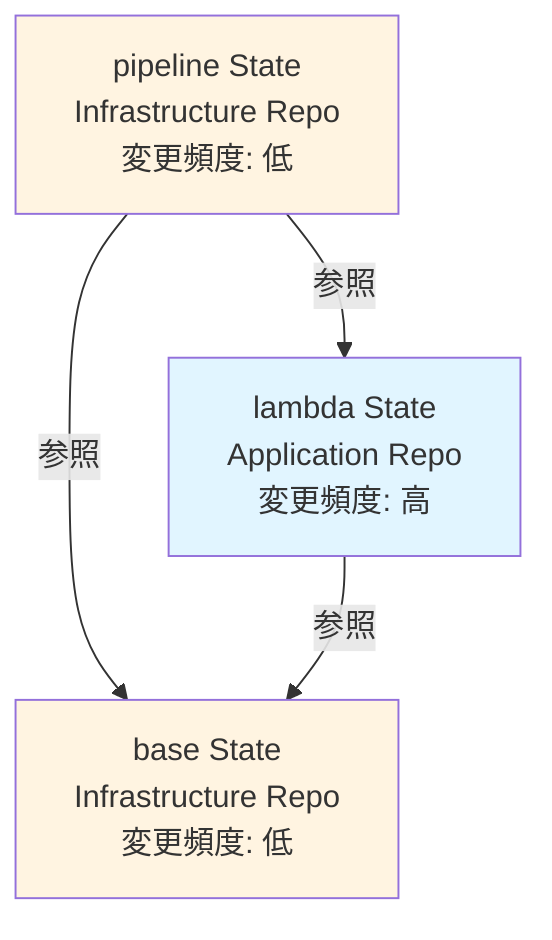
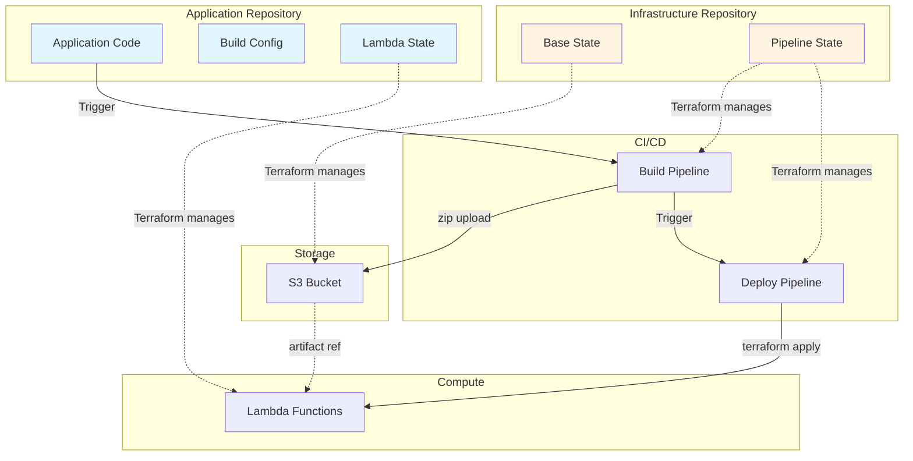
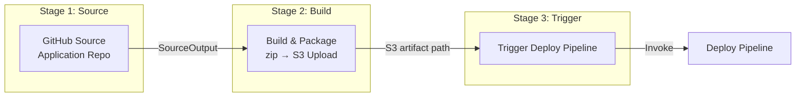
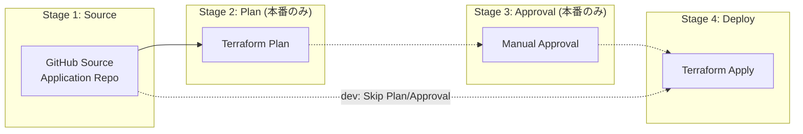
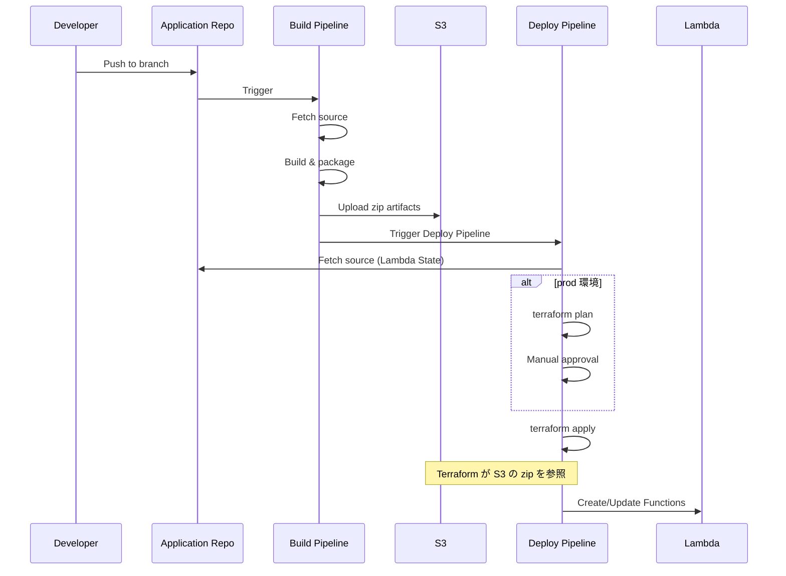

# Lambda アプリケーション CI/CD アーキテクチャガイドライン

## 目次

1. [概要](#概要)
2. [この構成を選ぶべきケース](#この構成を選ぶべきケース)
3. [State 管理とリポジトリ](#state-管理とリポジトリ)
4. [デプロイフロー](#デプロイフロー)
5. [デプロイ戦略の選択](#デプロイ戦略の選択)
6. [運用上の注意点](#運用上の注意点)
7. [実装リファレンス](#実装リファレンス)

---

## 概要

Terraform を使用して Lambda アプリケーションをデプロイする際の State 分割と CodePipeline によるデプロイフローの推奨アーキテクチャ。

[CodePipeline 標準化の方針](codepipeline-standard-policy.md) における **型 B**（`Source → Build → … → Build`）に該当する。ビルド成果物（zip アーティファクト）を S3 経由で Terraform Apply に渡すパターン。

### 主要な原則

- **State 分離**: 変更頻度とオーナーシップの異なる関心事を分離
- **リポジトリ分離**: Infrastructure リポジトリと Application リポジトリに分離
- **2 段階パイプライン**: Build と Deploy を独立したパイプラインに分離し、関心事を明確化
- **アーティファクトベース**: ビルド済み zip を S3 に保存し、Terraform から参照してデプロイ

### ECS パイプラインとの構造的な違い

| 観点 | ECS ([別ガイド](app-ecs-cicd-guideline.md)) | Lambda (本ガイド) |
|---|---|---|
| パイプライン数 | 1 本 | 2 本（Build + Deploy） |
| アーティファクト | Docker イメージ → ECR | zip → S3 |
| State 数 | 4（infra, task, service, pipeline） | 3（base, lambda, pipeline） |
| デプロイ手段 | CodeDeploy Blue/Green | Terraform Apply |
| Diff → Apply | パイプライン内で条件分岐 | Deploy Pipeline 全体が Terraform Apply |

**なぜ Lambda は 2 パイプラインなのか:**

ECS はイメージビルドとデプロイが 1 つのフロー（Build → Push → CodeDeploy）で完結するが、Lambda は「zip の作成・アップロード」と「Terraform による Lambda 関数の更新」が本質的に別の処理。分離することで：

1. **ビルド失敗がインフラ変更に波及しない**
2. **本番環境で Plan → Approval → Apply のゲートを挟める**
3. **ビルドだけ再実行、デプロイだけ再実行が可能**

---

## この構成を選ぶべきケース

| 条件 | Lambda (本ガイド) | ECS ([別ガイド](app-ecs-cicd-guideline.md)) |
|---|---|---|
| 実行時間 | 短時間（最大 15 分） | 長時間・常時稼働 |
| トラフィックパターン | スパイク・イベント駆動 | 安定的・予測可能 |
| コールドスタート | 許容できる | 許容できない |
| スケーリング | 自動（同時実行数制御のみ） | 手動 or Auto Scaling 設定が必要 |
| コスト | 実行時間課金（低トラフィックで有利） | 常時稼働コスト |
| カスタマイズ | マネージドランタイムの範囲内 | OS・ランタイムを自由に選択 |

---

## State 管理とリポジトリ

### なぜ 3 State に分割するのか

ECS と比べて State が 1 つ少ない（service State がない）。Lambda には「サービス定義」に相当するレイヤーがなく、関数定義と IAM ロールが直接アプリケーションに紐づくため。

```
          Freq: Low              Freq: High
        ┌──────────────────┐   ┌──────────────────┐
        │ base State       │   │                  │
Infra   │ (S3, SG, IAM)    │   │                  │
Team    │                  │   │                  │
        │ pipeline State   │   │                  │
        │ (CodePipeline)   │   │                  │
        └──────────────────┘   └──────────────────┘
        ┌──────────────────┐   ┌──────────────────┐
App     │                  │   │ lambda State      │
Team    │                  │   │ (Functions, IAM)  │
        │                  │   │ Application Code  │
        └──────────────────┘   └──────────────────┘
```

### State 依存関係



### ディレクトリ構成

```
# Infrastructure Repository
terraform/env/{env}/
├── {service}-base/         → {service}-base/terraform.tfstate
└── {service}-pipeline/     → {service}-pipeline/terraform.tfstate

# Application Repository
terraform/env/{env}/
└── {service}-lambda/       → {service}-lambda/terraform.tfstate

├── Taskfile.yaml            # ビルド設定
└── (application code)
```

### 各 State の責務

| State | 配置 | 主要リソース | 変更トリガー |
|---|---|---|---|
| **base** | Infrastructure | S3 (アーティファクト), DynamoDB, Security Group, 共通 IAM | 新リソース追加、権限変更 |
| **lambda** | Application | Lambda Functions, IAM Role/Policy, EventBridge, CloudWatch Logs | 関数追加、環境変数変更、トリガー変更 |
| **pipeline** | Infrastructure | CodePipeline (Build/Deploy), CodeBuild, S3 (パイプライン用) | パイプライン構成変更 |

**lambda State を Application リポジトリに置く理由**: Lambda 関数の定義（IAM ロール、トリガー、環境変数）はアプリケーションコードと密結合しており、コード変更と同じ PR で Terraform 変更もレビューできることがデプロイ速度に直結する。

---

## デプロイフロー

### 全体像



### Build Pipeline



**Build ステージの処理:**
1. ビルドツールのインストール（pip, npm, SAM CLI 等）
2. 依存関係の解決とパッケージング
3. zip 化して S3 にアップロード
4. Deploy Pipeline をトリガー

### Deploy Pipeline



**重要**: Deploy Pipeline の Source は `DetectChanges: false` に設定する。Application リポジトリへの push では自動トリガーされず、**Build Pipeline からの明示的なトリガーでのみ実行される。**

### 環境ごとのステージ構成

| 環境 | Plan | Approval | Apply |
|---|---|---|---|
| dev | スキップ | スキップ | 自動実行 |
| stg | 実行 | スキップ | 自動実行 |
| prod | 実行 | **手動承認** | 承認後に実行 |

この切り替えは `enable_plan_and_approval_stages` 変数で制御する。

### デプロイシーケンス全体



---

## デプロイ戦略の選択

Lambda のデプロイ戦略は ECS よりシンプルだが、トラフィックシフトが必要な場合は選択肢がある。

### 戦略の比較

| 戦略 | 仕組み | ロールバック | 適しているケース |
|---|---|---|---|
| **直接更新** (推奨) | `terraform apply` で関数コードを更新 | 前回の zip で再デプロイ | ほとんどのケース |
| **エイリアス + バージョン** | 新バージョンを発行し、エイリアスを切り替え | エイリアスを旧バージョンに戻す | ロールバック速度が重要 |
| **CodeDeploy + エイリアス** | CodeDeploy で段階的にトラフィックシフト | CodeDeploy が自動ロールバック | 段階的なリリース検証が必要 |

### 直接更新を推奨する理由

1. **シンプル**: Terraform の `terraform apply` だけで完結
2. **十分に高速**: Lambda のコード更新は数秒で完了
3. **Plan で事前確認可能**: 本番では Plan → Approval ゲートで安全性を担保
4. **追加の AWS リソースが不要**: CodeDeploy やエイリアス管理のオーバーヘッドがない

### エイリアス + バージョンを検討するケース

- 同一関数を複数環境（API Gateway ステージ等）から参照している
- ロールバック時に「前のバージョンに即座に戻す」要件がある
- Canary / Linear デプロイでトラフィックを段階的に移行したい

---

## 運用上の注意点

### アーティファクトの変更検知

Terraform は S3 上の zip ファイルの変更（`source_code_hash` や `s3_object_version`）を検知して Lambda 関数を更新する。以下の点に注意：

- **S3 バケットのバージョニングを有効化する**: 同一キーへの上書きでも変更を検知できる
- **zip 内のファイル順序やタイムスタンプ**: 同じコードでも zip の作り方で hash が変わる場合がある。ビルドの再現性を確保すること

### Build Pipeline と Deploy Pipeline の分離による影響

Build Pipeline が成功しても Deploy Pipeline が失敗する場合がある（Terraform の state lock、IAM 権限不足等）。この場合：

1. **S3 上のアーティファクトは更新済み** だが Lambda 関数は旧バージョンのまま
2. Deploy Pipeline を手動で再実行すれば解決する
3. アーティファクトが S3 に残っているため、再ビルドは不要

### 同時実行制御

Lambda の同時実行数制限（Reserved Concurrency）は lambda State で管理する。パイプラインのデプロイとは独立して変更可能。

### VPC 内 Lambda の注意点

Lambda を VPC 内に配置する場合、ENI のアタッチに時間がかかる（コールドスタートが長くなる）。VPC 接続が不要な Lambda は VPC 外に配置することを推奨する。

---

## 実装リファレンス

本ガイドラインのアーキテクチャは、リポジトリ内の既存モジュールと env 設定で実装済み。新規プロジェクトではこれらをコピー・カスタマイズして利用する。

### モジュール構成

| ガイドラインの概念 | モジュール / ディレクトリ | 説明 |
|---|---|---|
| Pipeline State 全体 | [`modules/codepipeline/pipeline-app-lambda/`](../../modules/codepipeline/pipeline-app-lambda/) | Build + Deploy 2 段パイプライン |
| コア (CodePipeline + CodeBuild) | [`modules/codepipeline/github-buildchain/`](../../modules/codepipeline/github-buildchain/) | `pipeline-app-lambda` が内部で利用する汎用モジュール |
| env 設定例 | [`terraform/env/dev/lambda-pipeline/`](../../terraform/env/dev/lambda-pipeline/) | dev 環境での呼び出し例 |

### ガイドラインの各ステージとモジュールの対応

| ステージ | モジュール側の実装 |
|---|---|
| Source | `github-buildchain/codepipeline.tf` の `stage "Source"` |
| Build 段 (Build & Upload) | `pipeline-app-lambda/main.tf` の `local.build_stage` (`key = "build"`) |
| Deploy 段 (Terraform Apply) | `pipeline-app-lambda/main.tf` の `local.deploy_stage` (`key = "deploy"`) |
| DetectChanges 制御 | `github-buildchain/codepipeline.tf` → `source_detect_changes` (trigger 指定時は自動 false) |
| CodeBuild プロジェクト | `github-buildchain/codebuild.tf` の `aws_codebuild_project.stage` |
| IAM (CodeBuild) | `github-buildchain/iam_codebuild.tf` + env の `data.tf` で `additional_iam_policy_json` を注入 |
| S3 成果物バケット | `github-buildchain/s3.tf` |

### 使い方

1. `terraform/env/{env}/{service}-pipeline/` ディレクトリを作成
2. `terraform/env/dev/lambda-pipeline/` を雛形としてコピー
3. `locals.tf` の値を自プロジェクトに合わせて変更

```
terraform/env/dev/lambda-pipeline/
├── main.tf        # module "lambda_cd" の呼び出し
├── locals.tf      # 接続 ARN, リポジトリ, ブランチ, buildspec パス
├── data.tf        # Deploy 段の IAM ポリシー (lambda:UpdateFunctionCode 等)
├── providers.tf
└── terraform.tf
```

### buildspec ファイルの配置

buildspec は **アプリケーションリポジトリ側** に配置する。パスは `pipeline-app-lambda` の `build_buildspec_path` / `deploy_buildspec_path` で指定する。

```
# アプリケーションリポジトリ
your-lambda-app/
├── buildspec.yml              # Build 段: 依存解決 → zip → S3 upload
├── deploy.buildspec.yml       # Deploy 段: terraform init → apply
├── terraform/env/{env}/
│   └── {service}-lambda/      # Lambda State (Terraform)
└── src/                       # アプリケーションコード
```

**Build 段の buildspec が行うこと:**
- 依存関係のインストール → zip 化 → S3 にアップロード → Deploy Pipeline をトリガー

**Deploy 段の buildspec が行うこと:**
- `terraform init` → `terraform apply`（S3 上の zip の変更を検知して Lambda を更新）

### カスタマイズポイント

| 変更したい内容 | 変更する場所 |
|---|---|
| ビルドコマンド (pip, npm 等) | アプリリポの `buildspec.yml` |
| Terraform apply のパス | アプリリポの `deploy.buildspec.yml` |
| Lambda 更新の IAM 権限 | env の `data.tf` → `deploy_stage_iam_policy_json` |
| トリガー条件 (ブランチ / パス) | env の `locals.tf` → `trigger` |
| CodeBuild のイメージ / スペック | env の `locals.tf` または module 呼び出しの変数 |
| Plan + Approval の有無 | 現時点ではモジュール未対応。`github-buildchain` を直接利用して `dynamic "stage"` で実装 |

---

## 関連ドキュメント

- [CodePipeline（IaC）標準化の方針](codepipeline-standard-policy.md) - 本ガイドは型 B に該当
- [State 分割ガイド](state-structure.md) - Terraform State 分割の一般的な指針
- [ECS アプリケーション CI/CD ガイドライン](app-ecs-cicd-guideline.md) - ECS 版のアーキテクチャ
