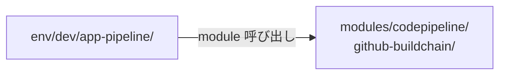
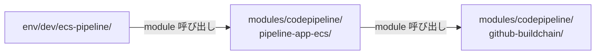
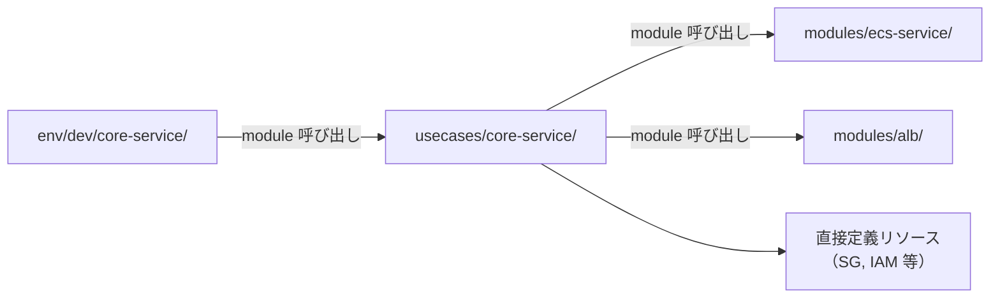
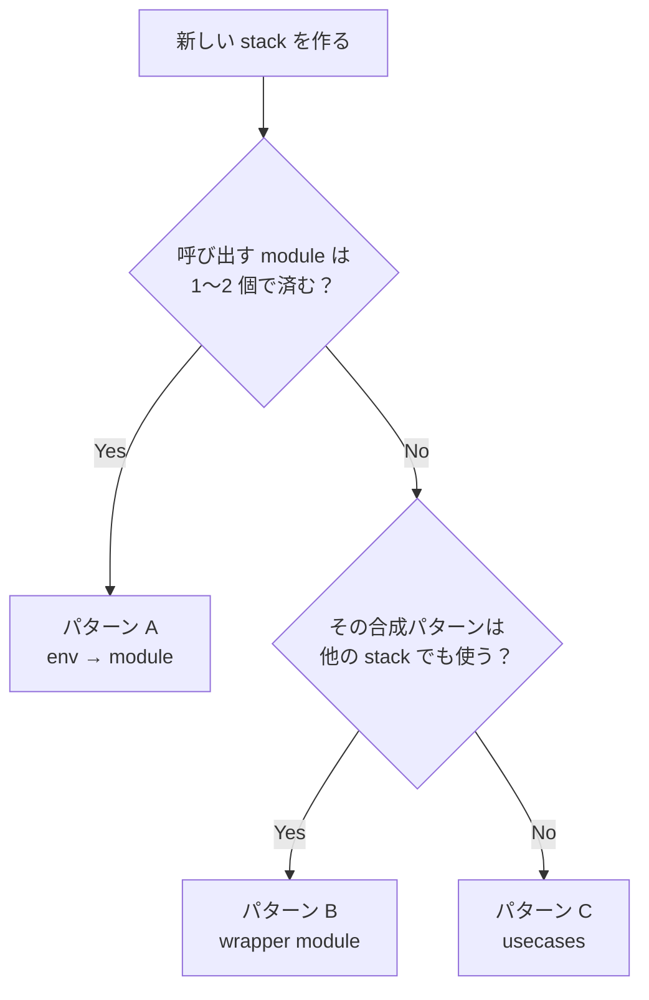
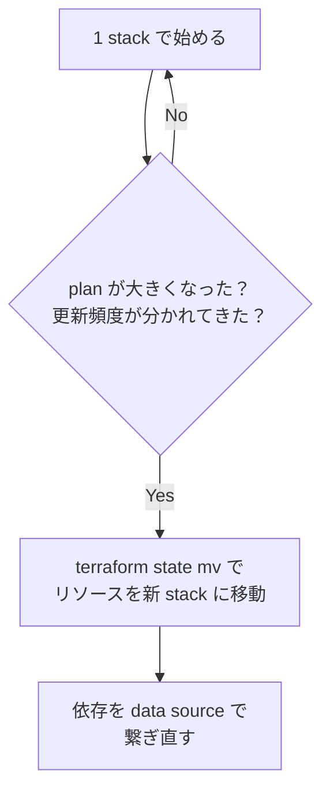

# ディレクトリ・ファイル構成リファレンス

本書は Terraform-dojo の構成を選ぶ際の判断ガイドです。  
ファイル一覧やコーディングルールは [Terraform コーディング規約](terraform-coding-guideline.md) を、state 分割の詳細は [State 分割ガイド](state-structure.md) を参照してください。

## 1. 構成パターンの選び方

Terraform-dojo は `env → usecases → modules` の 3 層を基本としていますが、常に 3 層が必要なわけではありません。

### パターン A: env → module（2 層）



env が module を直接呼ぶ。構成がシンプルな場合はこれで十分です。

**向いているケース:**

- 呼び出す module が 1〜2 個で済む
- env → module の入力マッピングだけで構成が表現できる
- 環境間で構造差がほぼない

**実例:** dojo の `terraform/env/dev/build-only/` は `github-buildchain` module を直接呼んでいます。

### パターン B: env → wrapper module → core module（2 層 + 合成）



module が別の module を内部で呼ぶ。**再利用可能な合成パターン**が生まれたときに使います。

**向いているケース:**

- 「core module + 追加リソース」の組み合わせが複数の stack で繰り返される
- 合成ロジック自体をバージョン管理・テストしたい

**実例:** dojo の `pipeline-app-ecs` は `github-buildchain` をラップし、ECS デプロイ用の CodeBuild ステージを追加しています。

### パターン C: env → usecase → modules（3 層）



**他のパターンではなく usecase を使うべきケース:**

- 1 つの stack で 3 つ以上の module + 直接リソースを組み合わせる
- その合成は特定のサービス固有であり、他の stack では再利用しない
- module に収めるには大きすぎるが、env に書くと環境固有値と構成ロジックが混ざる

### 判断フロー



**迷ったらパターン A から始める。** 複雑になった時点で B や C に移行する方が、最初から 3 層にするより安全です。

## 2. cross-stack 参照パターン

stack 間で値を共有する方法は 3 つあり、推奨度が異なります。

### 推奨: data source による参照

```hcl
# usecases/app-service/data.tf
data "aws_vpc" "main" {
  tags = {
    Name = "${var.stage}-main"
  }
}

data "aws_subnets" "private" {
  filter {
    name   = "vpc-id"
    values = [data.aws_vpc.main.id]
  }
  tags = {
    Tier = "private"
  }
}
```

**前提:** 参照先リソースのタグや名前に一貫した命名規則があること。  
**利点:** state 間の依存が生まれない。参照先が削除されれば plan 時にエラーになる。

### 許容: SSM Parameter Store を経由した参照

```hcl
# base stack で書き込み
resource "aws_ssm_parameter" "vpc_id" {
  name  = "/${var.stage}/network/vpc-id"
  type  = "String"
  value = module.vpc.id
}

# app-service stack で読み取り
data "aws_ssm_parameter" "vpc_id" {
  name = "/${var.stage}/network/vpc-id"
}
```

**使う場面:** タグや名前だけでは特定できないリソース（ARN、エンドポイント URL 等）を渡す場合。  
**注意:** パラメータの命名規則を決めておかないと、暗黙の依存が散らかる。

### 非推奨: terraform_remote_state

```hcl
# ❌ 原則として使わない
data "terraform_remote_state" "base" {
  backend = "s3"
  config = {
    bucket = "my-tfstate"
    key    = "base/terraform.tfstate"
    region = "ap-northeast-1"
  }
}
```

**問題:**

- state の出力形式に強く依存し、片方の変更がもう片方を壊す
- output の追加・削除が破壊的変更になる
- 参照先の state を先に apply しないと plan すらできない

**それでも使う場合:** 必須 output の一覧と更新手順を README に明記する。

## 3. stack 追加の判断基準

[Terraform 構成設計ガイド](terraform-structure-design-guide.md) のセクション 4〜5 に詳しい基準がありますが、ここでは実践的なチェックリストを示します。

### 新しい stack を切るべきとき

以下の **2 つ以上** に該当するなら、独立した stack にする:

- [ ] 既存 stack と更新頻度が明らかに異なる（例: 月 1 回 vs 日に数回）
- [ ] `plan` の差分が大きくなり、変更の影響範囲が読みづらい
- [ ] 失敗時に巻き込みたくないリソースがある（例: DB を巻き込みたくない）
- [ ] apply 権限を別のロールに分けたい
- [ ] リソースのライフサイクルが異なる（例: VPC は年単位、Lambda は日単位）

### まだ分けなくてよいとき

- 1 つ該当するだけでは分けない
- 「将来分けるかもしれない」だけでは分けない
- 分けた結果、apply の順序管理が複雑になるなら、まだ早い

### 分割の進め方



`terraform state mv` による移動手順は、実施前に必ず手順書を書いてから行う。

## 4. env 層の設計判断

### locals.tf vs variables.tf

`root module` は `terraform init/plan/apply` を実行するエントリーポイントです。

| 方式 | 使いどころ |
|------|-----------|
| `locals.tf` に値を直接書く | 環境固有値がリポジトリにコミットされる。再現性が高い |
| `variables.tf` + CLI `-var` | CI/CD から動的に値を渡す必要がある場合（例: イメージタグ） |

Terraform-dojo では **`locals.tf` を基本** とし、動的に渡す必要がある値だけ `variables.tf` に定義します。

```hcl
# locals.tf — 環境固有値（リポジトリにコミット）
locals {
  stage           = "dev"
  vpc_cidr        = "10.0.0.0/16"
  connection_arn  = "arn:aws:codeconnections:ap-northeast-1:..."
}

# variables.tf — CI/CD から渡す値だけ（必要な場合のみ作成）
variable "container_image_tag" {
  description = "デプロイするコンテナイメージのタグ。CI/CD から -var で渡す。"
  type        = string
}
```

### backend.tf を分離する理由

`terraform.tf` にまとめることもできますが、分離を推奨します。

- backend 設定は「この stack の state がどこにあるか」というアイデンティティ
- バージョン制約とは変更タイミングが異なる
- レビュー時に backend key の変更を見落としにくい

## 5. 全体像の早見表

```
project/
├── modules/                          # 再利用部品（state なし）
│   └── <module-name>/
│
└── terraform/
    ├── usecases/                     # stack の実体（state なし、必要な場合のみ）
    │   └── <stack>/
    │
    └── env/                          # root module（1 ディレクトリ = 1 state）
        ├── dev/
        │   ├── base/
        │   ├── app-service/
        │   └── app-pipeline/
        ├── stg/
        │   └── (dev と同じ stack 構成)
        └── prod/
            └── (dev と同じ stack 構成)
```

| 層 | 役割 | state | 必須 |
|----|------|-------|------|
| `env` | 環境固有値 + backend | あり | 常に必要 |
| `usecases` | 複雑な合成ロジック | なし | パターン C のみ |
| `modules` | 再利用可能な部品 | なし | 再利用がある場合 |

## 関連ドキュメント

- [Terraform 構成設計ガイド](terraform-structure-design-guide.md) — stack の切り方と命名
- [State 分割ガイド](state-structure.md) — state 分割の基準と backend key 規則
- [Terraform コーディング規約](terraform-coding-guideline.md) — 標準ファイル構成と書き方
- [モジュール設計ガイド](module-design-guideline.md) — module の入出力設計
