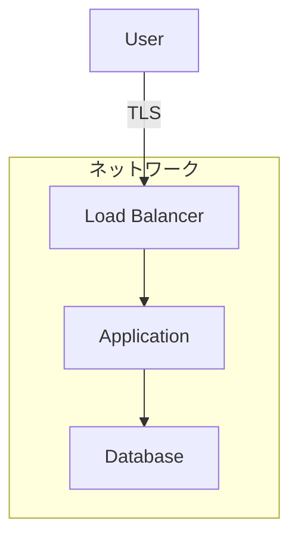

# {システム名} セキュリティレビュー

> **目的**: {対象システム}のセキュリティ構成を整理し、課題と改善オプションを提示する。
>
> **前提**: {システムのアクセスモデルやネットワーク配置の前提条件を簡潔に記述}

- 作成日: YYYY-MM-DD
- 作成者: {名前}
- 対象環境: {dev / prod / all}

---

## 1. 概要

<!-- システムのセキュリティレイヤーを図と表で俯瞰する。 -->



**セキュリティレベル一覧:**

| レイヤー | 現状 | 評価 |
|---|---|---|
| ネットワーク分離 | | 良好 / 要改善 / 未対応 |
| TLS | | |
| 認証 | | |
| 認可 | | |
| データ保護（保存時） | | |
| データ保護（転送時） | | |
| ログ / 監査 | | |

---

## 2. 現在のセキュリティ構成

<!-- レイヤーごとに現在の設定を詳細に記述する。
     設定箇所（ファイルパス・行番号）を明記すると追跡しやすい。 -->

### 2.1 ネットワーク

| 項目 | 設定値 | 設定箇所 |
|---|---|---|
| | | |

### 2.2 認証

**現状:** 

### 2.3 データ保護

**保存時の暗号化:**

| コンポーネント | 暗号化 | 設定箇所 |
|---|---|---|
| | | |

**転送時の暗号化:**

| 通信経路 | 暗号化 | 備考 |
|---|---|---|
| | | |

### 2.4 IAM

| ロール | アクセス可能なリソース |
|---|---|
| | |

### 2.5 ログ / 監査

| ログ種別 | 設定 | 保持期間 |
|---|---|---|
| | | |

---

## 3. セキュリティ課題

<!-- 課題ごとに「現状」「影響」「リスク評価」を記述する。
     重要度の高い順に並べる。 -->

### 3.1 {課題名} (重要度: 高/中/低)

**現状:**

**影響:**

**リスク評価:**

### 3.2 {課題名} (重要度: 高/中/低)

**現状:**

**影響:**

**リスク評価:**

---

## 4. 改善オプション

<!-- 課題ごとに改善オプションを提示する。
     オプションが複数ある場合は比較表を含める。 -->

### 4.1 {改善項目}

| オプション | 内容 | コスト影響 |
|---|---|---|
| A: | | |
| B: | | |
| C: 現状維持 | 変更なし | $0 |

**推奨: Option {X}**

<!-- 推奨理由と Terraform 実装例を含める。 -->

```hcl
# 実装例
```

**Pros:**
- 

**Cons:**
-

---

## 5. 推奨事項

<!-- 優先度と実装コストを考慮した推奨事項のまとめ。 -->

### 優先度: 高（本番デプロイ前に実施）

| # | 改善項目 | オプション | 実装コスト | 理由 |
|---|---|---|---|---|
| 1 | | | 小/中/大 | |

### 優先度: 中（本番デプロイ後に検討）

| # | 改善項目 | オプション | 実装コスト | 理由 |
|---|---|---|---|---|
| | | | | |

### 優先度: 低（将来的に検討）

| # | 改善項目 | オプション | 実装コスト | 理由 |
|---|---|---|---|---|
| | | | | |

---

## 6. ASK 項目まとめ

<!-- チームに判断を仰ぎたい事項。 -->

> 1. 
> 2. 
> 3. 

---

## 7. 対象ファイル一覧

### 変更対象（推奨事項の実施時）

| ファイル | 変更内容 |
|---|---|
| | |

### 参照ファイル（現状確認用）

| ファイル | 内容 |
|---|---|
| | |

---

## 参考資料

- [リンク](URL) - 説明
