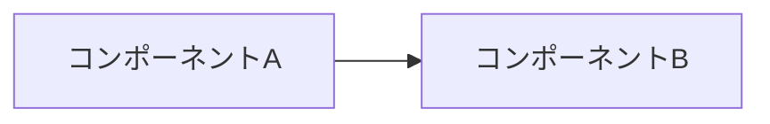
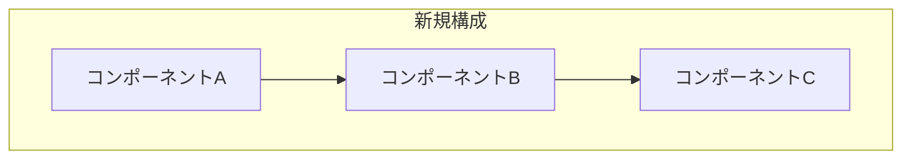

# {システム名} 技術設計書

- チケット: {チケットリンク（あれば）}
- 作成日: YYYY-MM-DD
- 作成者: {名前}
- 関連提案: {提案書へのリンク（あれば）}

---

## 1. 目的とスコープ

### 1.1 目的

<!-- この設計で実現すること。提案書が承認済みの場合は要約でよい。 -->

### 1.2 スコープ

**対象:**
- 

**非対象:**
- 

---

## 2. アーキテクチャ概要

### 2.1 現状（As-Is）

<!-- 現在の構成を図や表で示す。新規システムの場合は省略可。 -->



### 2.2 提案構成（To-Be）

<!-- 提案するアーキテクチャを図で示す。
     awsdac のダイアグラムがある場合はリンクする。 -->



---

## 3. 詳細設計

<!-- システムの主要コンポーネントごとに設計を記述する。
     セクション名は実際のコンポーネントに合わせて変更する。 -->

### 3.1 {コンポーネント名}

| プロパティ | 値 | 理由 |
|---|---|---|
| | | |

### 3.2 {コンポーネント名}

| プロパティ | 値 | 理由 |
|---|---|---|
| | | |

---

## 4. Terraform スタック構成

<!-- Terraform で管理する場合のスタック分割と依存関係を記述する。
     Terraform を使わない場合は削除。 -->

### スタック一覧

| # | Stack | State Key | 役割 |
|---|---|---|---|
| 1 | | | |
| 2 | | | |

### 依存関係

```
Phase 1:  stack-a
              |
Phase 2:  stack-b  +  stack-c  (並列可)
              |
Phase 3:  stack-d
```

### 作成/変更ファイル一覧

| ファイル | 変更内容 |
|---|---|
| | |

---

## 5. IAM / セキュリティ設計

<!-- IAM ロール、セキュリティグループ、シークレット管理の設計。 -->

### IAM ロール

| ロール名 | 用途 | 主要な権限 |
|---|---|---|
| | | |

### シークレット管理

| Secret パス | 内容 | 設定タイミング |
|---|---|---|
| | | |

---

## 6. デプロイメントシナリオ

<!-- デプロイの種類が複数ある場合（インフラ更新 vs アプリ更新など）を整理する。 -->

### シナリオ 1: {シナリオ名}

**トリガー:** 
**手順:**

### シナリオ 2: {シナリオ名}

**トリガー:**
**手順:**

---

## 7. コスト

### ベースコスト（固定）

| コンポーネント | 月額（概算） | 備考 |
|---|---|---|
| | | |

### 変動コスト

| 項目 | 条件 | 月額（概算） |
|---|---|---|
| | | |

---

## 8. 環境差分

<!-- dev / stg / prod で異なる設定値を整理する。 -->

| 項目 | dev | prod |
|---|---|---|
| | | |

---

## 9. 未決定事項

<!-- 設計時点で決まっていない事項を優先度別に整理する。
     ASK 項目は具体的な質問と影響範囲を書く。 -->

### 決定済み

| 項目 | 結論 | 備考 |
|---|---|---|
| | | |

### 高優先（実装開始前に決定必須）

| # | ASK 項目 | 影響範囲 |
|---|---|---|
| P0-1 | | |

### 中優先（実装中に決定）

| # | ASK 項目 | 影響範囲 |
|---|---|---|
| P1-1 | | |

---

## 10. 参考資料

- [リンク](URL) - 説明
