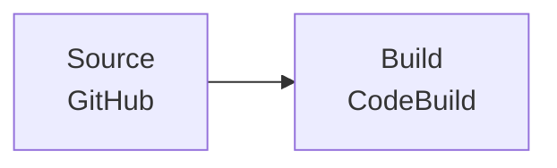

# build-only

型 A（Source → Build 1 段）のサンプル。[`github-buildchain`](../../../../modules/codepipeline/github-buildchain/) を直接呼び出す。

## パイプライン構成

## ユースケース

- ライブラリやパッケージの **CI（テスト・静的解析・ビルド確認）のみ** を自動化したい場合
- リリースは手動や別の仕組み（GitHub Releases、タグトリガーの別パイプライン等）で行い、CodePipeline ではビルドの成否だけ検証する場合
- モノレポの特定ディレクトリが変更されたときだけ CI を走らせたい場合（`trigger.file_paths` で制御）

## 使い方

`locals.tf` のプレースホルダを実際の値に書き換えてから `terraform plan`。
