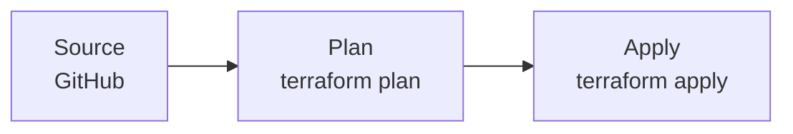

# infra-pipeline

型 C・Terraform plan/apply のサンプル。[`pipeline-infra-tf`](../../../../modules/codepipeline/pipeline-infra-tf/) を使用。

## パイプライン構成

## ユースケース

- Terraform によるインフラ変更を GitHub push をトリガーに **plan → apply** で自動化したい場合
- アプリデプロイ（型 A/B）とは IAM 権限・承認フロー・ブランチ戦略が異なるため、**別 root・別 state** で管理する
- Plan 段は state の読み取りとロック取得、Apply 段はそれに加えて state の書き込みとリソース変更に必要な権限を持つ

## 使い方

`locals.tf` のプレースホルダと `data.tf` の IAM ポリシー（state バケット ARN、DynamoDB ロックテーブル ARN、apply 用ロール ARN）を実際の値に書き換えてから `terraform plan`。
