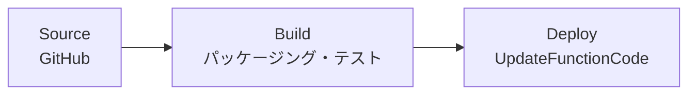

# lambda-pipeline

型 B・Lambda CD のサンプル。[`pipeline-app-lambda`](../../../../modules/codepipeline/pipeline-app-lambda/) を使用。

## パイプライン構成

## ユースケース

- Lambda 関数のコードを GitHub push をトリガーに **ビルド → デプロイ** まで自動化したい場合
- Build 段でパッケージング・テストを実行し、Deploy 段で `lambda:UpdateFunctionCode` 等によりデプロイする 2 段構成
- デプロイ先の Lambda ARN や IAM 権限は呼び出し側（`data.tf`）で定義するため、同じモジュールで複数の Lambda プロジェクトに対応できる

## 使い方

`locals.tf` のプレースホルダと `data.tf` の IAM ポリシーを実際の値に書き換えてから `terraform plan`。
